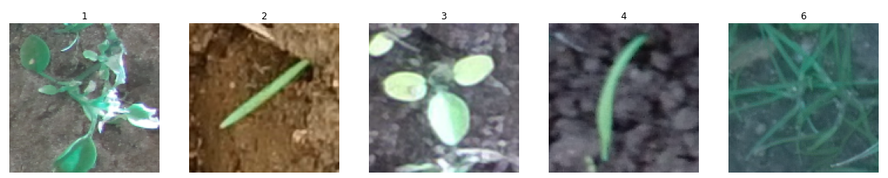

# Applying Regularization and Data Augmentation on CNN Model to Image Classification using Leaf counting dataset.

## Description:
This project contains five classes of plants with approximatelty 1,2,3,4 and 6 leafs used the Leaf counting dataset that as shown in the followed figure that cantains a sample for each class.

,then splitting the dataset into 70% train , 30% validation.

# Conclosion:
## Part 1a. Transfer Learning - Classification Network 

- After using the VGG-16 model with input_shape=(128X128),some parameters such as, include_top = false, which means that I'm not interested in the last layer of the model;weights="imagenet" means to have the pre-trained weights for the imagenet dataset. I freezed the layers by using(layer.trainable = False) which moves all the layer's weights from trainable to non-trainable
- I used the first 2 blocks of VGG-16 and added some layers to create a CNN network for the classification of the images,including the final output layer which includes 5 classes.
- As shown in the graph loss,the overall loss in the train and the validation curves decreases.
- As shown in the graph accuracy,the overall accuracy in the training and validation increases.The difference is very big between the train curve and the validation curve,which means there is an overfitting.
- As shown in the training data,there is an overfitting as the accuracy started from 21% up to 100% by using 70 epochs and 0.0002 learning rate,128 batch size.The model's final accuracy on the data training according to the classification report is 100% and the confusion matrix refers that the data training is very good , it can correctly classify every image in the training data.
- As shown in the validation data,the accuracy started from 17 up to 31% but the model's final accuracy is 31% according to the classification report,which means that the model cannot perform well on the validation data.
- In the testing data, the model scored 28% accuracy and couldn't recognize most of the actual classes according to the confusion Matrix shown above, the model only recognized 28% right classes from 100 classes.

## Part 1b (Transfer Learning Regression):-

- After using the VGG-16 model with input_shape=(128X128),some parameters such as, include_top = false, which means that I'm not interested in the last layer of the model;weights="imagenet" means to have the pre-trained weights for the imagenet dataset. I freezed the layers by using(layer.trainable = False) which moves all the layer's weights from trainable to non-trainable, classifier_activation="linear"

- I used the first 2 blocks of VGG-16 and added layers to create a CNN network for the regression of the images,including the final output layer which includes 1 class.

- As shown in the training data,there is overfitting. The accuracy started from 20% up to 40% and the mean_squared_error started from 4 and decreased to 0 using 70 epochs, 0.0002 learning rate and 128 batch size.The model's final accuracy on the data training according to the classification report is 100% and the confusion matrix refers that the data training is very good , it can correctly classify every image in the training data.

- As shown in the validation data,the accuracy ranges between 20% to 22%, but the model's final accuracy is 32% according to the classification report,which means that the model cannot perform well on the validation data.

- In the testing data, the model scored 27% accuracy and couldn't recognize most of the actual classes according to the confusion Matrix shown above, the model only recognized 27% right classes from 100 classes.

- As shown in the graph loss,the overall loss in the train and the validation curves decreases.

- As shown in the graph accuracy,the overall accuracy in the training and validation increases. The accuracy in the train curve increases and the validation curve doesn't change much,which means there is overfitting.

- As shown in the graph mean_squared_error,the overall mean_squared_error in the train and the validation curves decreases.

## To improve the model
### Step 1(Regularization):-

- By using dropout and batch normalization layers in the VGG-16 model and the final output layer includes 5 classes,the accuracy started from 22% up to 99% by using 70 epochs and 0.0002 learning rate and 128 batch size.The model's final accuracy of the data training according to the classification report is 100% and the confusion matrix refers to the fact that the data training is very good , it can correctly classify every image in the training data,but there is an small inhancement to the model than before after adding the dropout and the batch normalization layers to the model as the loss is 0 which means the train model predicts the classes correctly.

- As shown in the validation data,the accuracy started from 18% up to 52%, but the model's final accuracy is 53% according to the classification report,which means that the model cannot perform well on the validation data when entering new data into the model. It couldn't predict well as it predicted 49% of the data correctly ,but it got better accuracy than before.

- On the testing data, the model scored 40% and couldn't recognize most of the actual classes according to the confusion Matrix shown above. The model only recognized 40% of the right classes from 100 classes.The accuracy of the test model increased more than before as it was 28%.

- As shown in the graph loss,the overall loss in the train and the validation curves started from 2 and decreased to 0 in the training loss and from 3 to 1 in the validation loss.

- As shown in the graph accuracy,the overall accuracy in the training and validation increases .The difference between the train curve and the validation curve is big,which means there is an overfitting.
### Step 2 (Data Augmentation):-

- By using dropout and batch normalization layers in the model and applying augmentation to the dataset which increased the number of the data,there is also an overfitting in the training data. The accuracy started from 21% up to 99% by using 70 epochs and 0.0002 learning rate and 128 batch size.The model's final accuracy in the data training according to the classification report is 100% and the confusion matrix refers that the model in the data training predicts well,which means it classifieed correctly every image in the training data,but there is an inhancement in the model than before after applying data augmentation to the model as the loss is 0 which means the train model predicts all the classes correctly.

- As shown in the validation data,the accuracy started from 22% up to 51%, and the model's final accuracy is 51% according to the classification report,which means that the model cannot perform well on the validation data when entering new data into the model. It couldn't predict well as it predicted only 51% of the data correctly ,but it got better accuracy than before.

- On the testing data, the model scored 42% and couldn't recognize most of the actual classes according to the confusion Matrix shown above. The model only recognized 42% of the right classes from 100 classes.The accuracy of the test model has been increased than before in the regularization.

- As shown in the graph loss,the overall loss in the train and the validation curves started from 2 and decreased to 0 in the training loss and from 3 to 1 in the validation loss.

- As shown in the graph accuracy,the overall accuracy in the training and validation increases.The difference between the train curve and the validation curve is big,which means there is an overfitting but it decreased than before in the classification,so the data augmentation and regularization couldn't solve the overfitting problem, but the model improved slightly from the first and it was noticable in the validation and testing,so if we increased the number of layers and images,it may solve the problem of overfitting.

